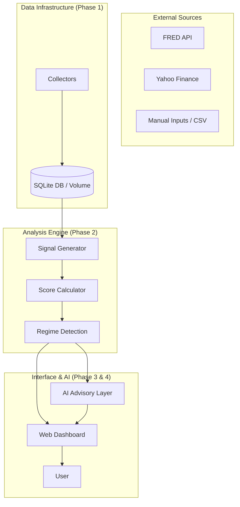

# Semi-Intel: Semiconductor Investment Intelligence Manual

반도체 및 AI 섹터 투자 의사결정을 위한 데이터 중심 지능형 분석 시스템, **Semi-Intel**에 오신 것을 환영합니다. 이 매뉴얼은 시스템의 비전부터 기술 아키텍처, 그리고 실제 운영 방법까지 한눈에 파악할 수 있도록 구성되었습니다.

---

## 1. 프로젝트 개요 (Overview)

### 🎯 비전 및 배경
반도체 산업은 거대한 '사이클(Cycle)'의 산업입니다. 수요와 공급의 불균형, 매크로 경제 지표의 변화에 따라 기업의 가치가 극명하게 엇갈립니다. **Semi-Intel**은 Bernard Baumohl의 저서 *"The Secrets of Economic Indicators"*의 이론적 기반 위에, 현대 인공지능(AI) 수요 데이터를 결합하여 **현재 반도체 사이클의 위치를 정량적으로 산출**하고 투자 전략을 제시합니다.

### 💡 핵심 철학
- **데이터 중심**: 주관적인 느낌이 아닌 22개 핵심 경제 지표의 숫자로 말합니다.
- **다차원 분석**: 수요, 공급, 가격, 매크로, 글로벌 수요라는 5가지 차원을 입체적으로 분석합니다.
- **AI 조언**: 차가운 숫자 데이터에 AI의 통찰을 더해 최적의 투자 브리핑을 제공합니다.

---

## 2. 시스템 아키텍처 (System Architecture)

Semi-Intel은 다음과 같은 데이터 흐름을 통해 작동합니다.



### 🛠 기술 스택
- **Backend**: Python 3.10+, FastAPI
- **Database**: SQLAlchemy, SQLite (Railway Volume 연동)
- **Data**: Pandas, NumPy, Scikit-learn
- **AI**: Google Gemini (기본), Anthropic Claude, OpenAI GPT 지원
- **Frontend**: React (TailwindCSS 활용 정적 대시보드)

---

## 3. Phase별 개발 및 기능 구조

### 🟦 Phase 1: 데이터 인프라
- **FRED 수집기**: 56개 이상의 FRED 시리즈를 자동 수집 및 증분 업데이트.
- **시장 데이터**: Yahoo Finance API를 통해 SOX 지수, 빅테크 주가 수집.
- **수동 입력**: DRAM 가격, SEMI B/B Ratio 등 API 제공이 어려운 데이터의 CSV 임포트 지원.

### 🟩 Phase 2: 분석 엔진
- **Signal Generator**: 각 지표의 MoM%, YoY%, Z-score 등을 계산하여 Bullish(상승), Bearish(하강), Neutral(중립) 신호 생성.
- **Composite Score**: 5개 차원별 가중치를 적용하여 0~100점 사이의 '반도체 사이클 점수' 산출.
- **Regime Detection**: Expansion(확장), Late Cycle(후기), Contraction(수축), Recovery(회복)의 4단계 자동 판별.

### 🟧 Phase 3: 웹 대시보드
- **실시간 모니터링**: 사이클 스코어 게이지, 차원별 레이더 차트 제공.
- **트렌트 시각화**: 스코어의 시계열 변화추이를 통한 변곡점 포착.
- **반응형 설계**: PC와 모바일 어디서나 투자 신호 확인 가능.

### 🟪 Phase 4: AI 조언 레이어 (Advisory Layer)
- **Context Builder**: 현재 수집된 모든 수치 데이터를 AI가 이해할 수 있는 컨텍스트로 자동 변환.
- **투자 브리핑**: "지금 당장 어떤 섹터의 비중을 늘려야 하는가?"에 대한 AI의 상세 분석 제공.

---

## 4. 초보자를 위한 Quick Start (5분 완성)

### 1단계: 설치 및 환경 설정
```bash
# 코드 내려받기 및 이동
git clone [repository_url]
cd semi-intel

# 가상환경 및 패키지 설치
python -m venv venv
source venv/bin/activate
pip install -r requirements.txt
```

### 2단계: API 키 등록
`.env.example` 파일을 복사하여 `.env` 파일을 만들고 키를 입력합니다.
- `FRED_API_KEY`: [FRED 홈페이지](https://fred.stlouisfed.org/)에서 무료 발급
- `GOOGLE_API_KEY`: [Google AI Studio](https://aistudio.google.com/)에서 무료 발급

### 3단계: 데이터 초기화 및 수집
```bash
# DB 테이블 생성 및 메타데이터 동기화
python main.py setup

# 첫 데이터 전체 수집 (약 1분 소요)
python main.py collect
```

### 4단계: 대시보드 실행
```bash
python -m api.server
```
접속 주소: **[http://localhost:8000](http://localhost:8000)**

---

## 5. 상세 운영 및 클라우드 배포

### ☁️ Railway 클라우드 배포 가이드
1. **GitHub 연동**: 본 리포지토리를 GitHub에 올리고 Railway와 연결합니다.
2. **Volume 설정**: Railway 대시보드에서 `Volume`을 생성하고 Mount Path를 `/data`로 설정합니다.
3. **환경 변수**: Railway의 `Variables` 탭에 `.env`의 내용들을 모두 입력합니다. (`DB_PATH=/data/semi_intel.db` 필수)

### ⌨️ 주요 CLI 명령어 (운영용)
- `python main.py status`: 현재 데이터 수집 현황 요약 보고서 출력.
- `python main.py briefing`: 콘솔에서 즉시 AI 투자 브리핑 확인.
- `python main.py scheduler`: 백그라운드 수집 데몬 실행 (로컬용).

---

## 6. AI 분석가 활용 팁

AI 조언 레이어는 단순히 요약만 해주는 것이 아닙니다. 다음과 같은 질문을 통해 심층 분석을 요청할 수 있습니다. (대시보드 또는 `ai-ask` 명령어 사용)

- *"최근 ISM 제조업 PMI 하락이 반도체 장비주에 미칠 영향은?"*
- *"현재의 Yield Curve 역전이 과거 2008년 사이클과 다른 점은?"*
- *"AI CapEx가 계속 늘어날 때 삼성전자와 하이닉스의 수혜 차이는?"*

---

**Semi-Intel**은 당신의 투자 판단을 돕는 가장 강력한 도구가 될 것입니다. 데이터로 사이클을 읽고, AI로 전략을 세우세요.
